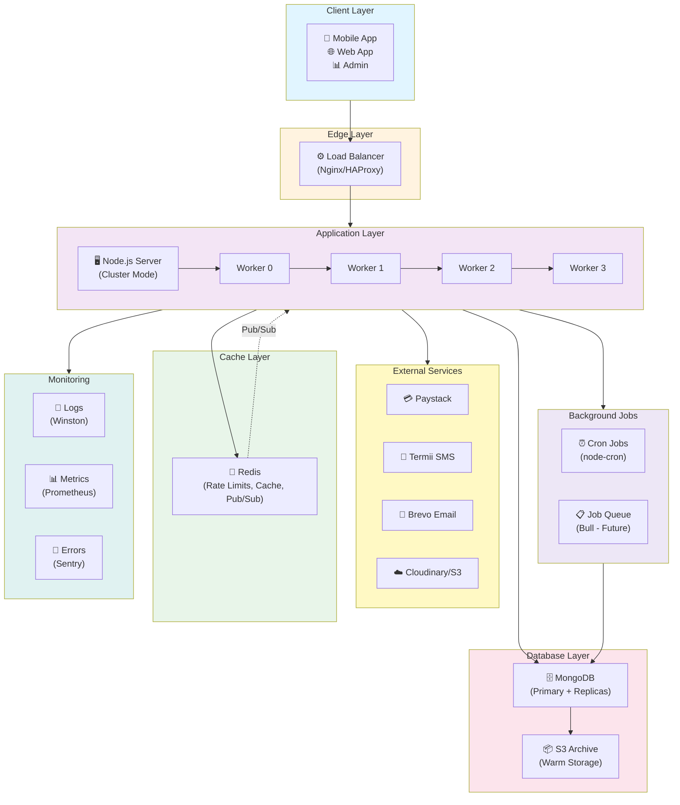

# OffScape Logistics Platform - System Architecture Diagram

## VISUAL ARCHITECTURE OVERVIEW

```
╔══════════════════════════════════════════════════════════════════════════════╗
║                   OFFSCAPE LOGISTICS PLATFORM - SYSTEM ARCHITECTURE           ║
║                        (Current State & Scalable Design)                      ║
╚══════════════════════════════════════════════════════════════════════════════╝


┏━━━━━━━━━━━━━━━━━━━━━━━━━━━━━━━━━━━━━━━━━━━━━━━━━━━━━━━━━━━━━━━━━━━━━━━━━━━━┓
┃ LAYER 1: EXTERNAL USERS & CLIENTS                                            ┃
┗━━━━━━━━━━━━━━━━━━━━━━━━━━━━━━━━━━━━━━━━━━━━━━━━━━━━━━━━━━━━━━━━━━━━━━━━━━━━┛

    📱 Mobile App              🌐 Web App                📊 Admin Dashboard
    (Customer/Rider)          (React/Vue)              (Analytics)
         │                         │                         │
         └─────────────────────────┼─────────────────────────┘
                                   │
                         [HTTPS Traffic]
                                   │
                    ┌──────────────┴──────────────┐
                    │                             │
              [REST API]                   [WebSocket]
                    │                             │
                    ▼                             ▼


┏━━━━━━━━━━━━━━━━━━━━━━━━━━━━━━━━━━━━━━━━━━━━━━━━━━━━━━━━━━━━━━━━━━━━━━━━━━━━┓
┃ LAYER 2: LOAD BALANCING & SECURITY (Entry Point)                             ┃
┗━━━━━━━━━━━━━━━━━━━━━━━━━━━━━━━━━━━━━━━━━━━━━━━━━━━━━━━━━━━━━━━━━━━━━━━━━━━━┛

    ┌───────────────────────────────────────────────────────────────┐
    │                   NGINX / HAProxy                             │
    │              (Load Balancer / Reverse Proxy)                  │
    │  - Distributes requests to multiple servers                   │
    │  - Sticky sessions for WebSocket                              │
    │  - SSL/TLS termination                                        │
    │  - Rate limiting at ingress                                   │
    └───────────────────────────┬───────────────────────────────────┘
                                │
                 ┌──────────────┼──────────────┐
                 │              │              │
                 ▼              ▼              ▼


┏━━━━━━━━━━━━━━━━━━━━━━━━━━━━━━━━━━━━━━━━━━━━━━━━━━━━━━━━━━━━━━━━━━━━━━━━━━━━┓
┃ LAYER 3: APPLICATION SERVERS (Node.js Cluster)                               ┃
┗━━━━━━━━━━━━━━━━━━━━━━━━━━━━━━━━━━━━━━━━━━━━━━━━━━━━━━━━━━━━━━━━━━━━━━━━━━━━┛

    ┌─────────────────────────────────────────────────────────────┐
    │                      SERVER 1 (Prod)                        │
    │                                                             │
    │  ┌──────────────────────────────────────────────────────┐  │
    │  │         Node.js Cluster (4 CPU Cores)               │  │
    │  │                                                      │  │
    │  │  ┌──────────┐  ┌──────────┐  ┌──────────┐  ┌──────┐│  │
    │  │  │ Worker 0 │  │ Worker 1 │  │ Worker 2 │  │Work 3││  │
    │  │  │ (Master) │  │          │  │          │  │      ││  │
    │  │  │ Crons    │  │          │  │          │  │      ││  │
    │  │  └────┬─────┘  └────┬─────┘  └────┬─────┘  └───┬──┘│  │
    │  │       │             │             │            │   │  │
    │  │  ┌────┴─────────────┴─────────────┴────────────┴──┐│  │
    │  │  │                                                ││  │
    │  │  │         Middleware Stack:                      ││  │
    │  │  │  ✓ Helmet (security headers)                   ││  │
    │  │  │  ✓ CORS (origin whitelist)                     ││  │
    │  │  │  ✓ Morgan (HTTP logging)                       ││  │
    │  │  │  ✓ Rate Limiter (Redis-backed)                 ││  │
    │  │  │  ✓ Input Validator (Joi schemas)               ││  │
    │  │  │  ✓ Sanitizer (NoSQL injection prevention)      ││  │
    │  │  │  ✓ Auth Handler (JWT verification)             ││  │
    │  │  │  ✓ Error Handler (global exception)            ││  │
    │  │  │                                                ││  │
    │  │  └────────────────────────────────────────────────┘│  │
    │  │                      │                              │  │
    │  │            ┌─────────┼─────────┐                    │  │
    │  │            │         │         │                    │  │
    │  │            ▼         ▼         ▼                    │  │
    │  │  ┌──────────────┐ ┌────────┐ ┌────────────────┐    │  │
    │  │  │ Route Layer  │ │ Socket │ │ Service Layer  │    │  │
    │  │  │              │ │ IO     │ │                │    │  │
    │  │  │ ✓ /auth/*    │ │ Server │ │ ✓ Auth         │    │  │
    │  │  │ ✓ /orders/*  │ │        │ │ ✓ Orders       │    │  │
    │  │  │ ✓ /wallet/*  │ │ (WS)   │ │ ✓ Payments     │    │  │
    │  │  │ ✓ /zones/*   │ │        │ │ ✓ SMS/Email    │    │  │
    │  │  │ ✓ /webhook/* │ │        │ │ ✓ Geolocation  │    │  │
    │  │  └──────────────┘ └────────┘ └────────────────┘    │  │
    │  └──────────────────────────────────────────────────┘  │
    │                      │         │                       │
    └──────────────────────┼─────────┼───────────────────────┘
                           │         │
                ┌──────────┘         └──────────┐
                │                               │
                ▼                               ▼


┏━━━━━━━━━━━━━━━━━━━━━━━━━━━━━━━━━━━━━━━━━━━━━━━━━━━━━━━━━━━━━━━━━━━━━━━━━━━━┓
┃ LAYER 4: CACHING & SESSION LAYER (Redis)                                     ┃
┗━━━━━━━━━━━━━━━━━━━━━━━━━━━━━━━━━━━━━━━━━━━━━━━━━━━━━━━━━━━━━━━━━━━━━━━━━━━━┛

    ┌─────────────────────────────────────────────────────────────┐
    │                    REDIS (In-Memory Store)                  │
    │                   (ioredis Client Config)                   │
    │                                                             │
    │  Organized by namespace:                                    │
    │  ┌──────────────────────────────────────────────────────┐  │
    │  │                                                      │  │
    │  │  Cache:              Counters:    Blocklist:         │  │
    │  │  ┌─────────────────┐ ┌──────────┐ ┌──────────────┐  │  │
    │  │  │ os:zones        │ │rl:login: │ │blocklist:jwt│  │  │
    │  │  │ os:config       │ │ 3/5      │ │ JTI expires  │  │  │
    │  │  │ os:cache:*      │ │          │ │ on logout    │  │  │
    │  │  │ (5min TTL)      │ │rl:api:   │ │              │  │  │
    │  │  └─────────────────┘ │ 45/100   │ └──────────────┘  │  │
    │  │                      │          │                    │  │
    │  │  Pub/Sub:            │rl:payment│ Webhooks:         │  │
    │  │  ┌─────────────────┐ │ 2/8      │ ┌──────────────┐  │  │
    │  │  │order:updates    │ └──────────┘ │webhook:paymentId│ │
    │  │  │location:tracking│              │ (idempotency)    │  │
    │  │  │socket:events    │              └──────────────────┘ │  │
    │  │  └─────────────────┘                                   │  │
    │  │                                                      │  │
    │  │  Current: Single instance                           │  │
    │  │  At scale: Redis Cluster (3-10 nodes)               │  │
    │  │  Max throughput: 50K ops/sec → 500K ops/sec        │  │
    │  │                                                      │  │
    │  └──────────────────────────────────────────────────────┘  │
    └─────────────────────────────────────────────────────────────┘
                           │      │      │
        ┌──────────────────┼──────┼──────┼─────────────────┐
        │                  │      │      │                 │
        ▼                  ▼      ▼      ▼                 ▼


┏━━━━━━━━━━━━━━━━━━━━━━━━━━━━━━━━━━━━━━━━━━━━━━━━━━━━━━━━━━━━━━━━━━━━━━━━━━━━┓
┃ LAYER 5: DATA PERSISTENCE & STORAGE                                           ┃
┗━━━━━━━━━━━━━━━━━━━━━━━━━━━━━━━━━━━━━━━━━━━━━━━━━━━━━━━━━━━━━━━━━━━━━━━━━━━━┛

    ┌────────────────────────────────────────────────────────────┐
    │              PRIMARY DATABASE: MongoDB                     │
    │         (Atlas Cluster / Self-Hosted Replica Set)          │
    │                                                            │
    │  ┌──────────────────────────────────────────────────────┐ │
    │  │              Connection Pool (5-200)                 │ │
    │  │  - Mongoose manages connections                      │ │
    │  │  - Auto-reconnect on network failure                 │ │
    │  │  - Configurable heartbeat (10s)                      │ │
    │  └──────────────────────────────────────────────────────┘ │
    │                           │                               │
    │  ┌────────────────────────┴────────────────────────────┐  │
    │  │                                                    │  │
    │  │         COLLECTIONS (Namespaced)                  │  │
    │  │                                                    │  │
    │  │  ┌──────────────┐  ┌──────────────┐  ┌─────────┐ │  │
    │  │  │ users        │  │ orders       │  │ wallets │ │  │
    │  │  │              │  │              │  │         │ │  │
    │  │  │ • customer   │  │ • reference  │  │ • owner │ │  │
    │  │  │ • merchant   │  │ • customer   │  │ • balance   │  │
    │  │  │ • pickman    │  │ • merchant   │  │ • history   │  │
    │  │  │ • admin      │  │ • pickup     │  │ • codPending│  │
    │  │  │ • support    │  │ • delivery   │  │         │ │  │
    │  │  │              │  │ • package    │  └─────────┘ │  │
    │  │  │ Indexes:     │  │ • fees       │              │  │
    │  │  │ • email+role │  │ • payment    │  ┌─────────┐ │  │
    │  │  │ • phone+role │  │ • status     │  │ zones   │ │  │
    │  │  │ • city+role  │  │ • timeline   │  │         │ │  │
    │  │  │ • location   │  │ • cod        │  │ • name  │ │  │
    │  │  │              │  │              │  │ • bounds│ │  │
    │  │  │              │  │ Indexes:     │  │ • rates │ │  │
    │  │  │              │  │ • status     │  │ • fees  │ │  │
    │  │  │              │  │ • customer   │  │         │ │  │
    │  │  │              │  │ • pickman    │  └─────────┘ │  │
    │  │  │              │  │ • createdAt  │              │  │
    │  │  │              │  │ • timeline   │  ┌─────────┐ │  │
    │  │  │              │  │              │  │ sessions│ │  │
    │  │  │              │  │              │  │ tickets │ │  │
    │  │  │              │  │              │  │ kyc     │ │  │
    │  │  │              │  │              │  │ config  │ │  │
    │  │  │              │  │              │  │         │ │  │
    │  │  └──────────────┘  └──────────────┘  └─────────┘ │  │
    │  │                                                    │  │
    │  │  Replication Strategy:                             │  │
    │  │  • Primary: Handles writes + some reads            │  │
    │  │  • Secondary-1: Handles reads, auto-failover       │  │
    │  │  • Secondary-2: Handles reads, disaster recovery   │  │
    │  │                                                    │  │
    │  └────────────────────────────────────────────────────┘  │
    │                                                            │
    │  At Scale (Phase 2+):                                     │
    │  • Sharding by geography (Lagos/Ibadan/Abuja/PHC)         │
    │  • Separate read replicas per shard                       │
    │  • Archival to S3 for orders >6 months                    │
    │                                                            │
    └────────────────────────────────────────────────────────────┘
                           │      │
                ┌──────────┘      └──────────┐
                │                           │
                ▼                           ▼


    ┌─────────────────────────────────────────────────────────────┐
    │          EXTERNAL INTEGRATIONS (Third Party APIs)           │
    │                                                             │
    │  ┌───────────────────────────────────────────────────────┐ │
    │  │ Payment Gateway     SMS Service      Email Service    │ │
    │  │ (Paystack)          (Termii)         (Brevo)          │ │
    │  │                                                       │ │
    │  │ - Charge card       - Send OTP       - Verification  │ │
    │  │ - Handle webhook    - Status remind  - Notification  │ │
    │  │ - Verify payment    - Alerts         - Receipts      │ │
    │  │                                                       │ │
    │  │ Circuit breaker:    Circuit breaker: Circuit breaker: │ │
    │  │ - 3s timeout        - 2s timeout    - 5s timeout      │ │
    │  │ - 50% error rate    - 70% error     - 60% error       │ │
    │  │ - 30s recovery      - 20s recovery  - 40s recovery    │ │
    │  └───────────────────────────────────────────────────────┘ │
    │                                                             │
    │  Cloud Storage:       KYC Verification:                   │
    │  (AWS S3 / Cloudinary) (Smile Identity)                    │
    │                                                             │
    │  - Profile pictures   - Verify BVN                        │
    │  - Delivery proofs    - Government ID                     │
    │  - Invoice PDFs       - Liveness check                    │
    │                                                             │
    │  CDN (CloudFlare):                                         │
    │  - Static asset caching                                   │
    │  - Global distribution                                    │
    │  - DDoS protection                                        │
    │                                                             │
    └─────────────────────────────────────────────────────────────┘
                           │
                           ▼


┏━━━━━━━━━━━━━━━━━━━━━━━━━━━━━━━━━━━━━━━━━━━━━━━━━━━━━━━━━━━━━━━━━━━━━━━━━━━━┓
┃ LAYER 6: BACKGROUND JOBS & SCHEDULING                                         ┃
┗━━━━━━━━━━━━━━━━━━━━━━━━━━━━━━━━━━━━━━━━━━━━━━━━━━━━━━━━━━━━━━━━━━━━━━━━━━━━┛

    ┌─────────────────────────────────────────────────────────────┐
    │           Cron Jobs (node-cron on Worker 0)                │
    │           + Job Queue (Bull - Future Enhancement)          │
    │                                                             │
    │  Scheduled Tasks:                 Job Queues (Future):     │
    │  ┌──────────────────────────────┐ ┌───────────────────────┐│
    │  │ Every 5 minutes:             │ │ Payment Webhook Queue ││
    │  │ - Mark stale riders offline  │ │ - Process payments    ││
    │  │                              │ │ - Retry on failure    ││
    │  │ Every midnight:              │ │ - Circuit breaker     ││
    │  │ - Send COD fee reminders     │ │                       ││
    │  │ - Account reconciliation     │ │ SMS Queue             ││
    │  │                              │ │ - Send notifications  ││
    │  │ Every Monday 8am:            │ │ - Batch processing    ││
    │  │ - Weekly earnings summary    │ │                       ││
    │  │ - Performance reports        │ │ Email Queue           ││
    │  │                              │ │ - Verification links  ││
    │  │ Monthly (1st, 2am):          │ │ - Receipts            ││
    │  │ - Archive old orders to S3   │ │                       ││
    │  │ - Cleanup expired tokens     │ │ Analytics Queue       ││
    │  │ - Database maintenance       │ │ - Compute metrics     ││
    │  │                              │ │ - Update dashboards   ││
    │  └──────────────────────────────┘ └───────────────────────┘│
    │                                                             │
    │  Current: Only Worker 0 runs (no duplicates)               │
    │  At scale: Separate job scheduler service                  │
    │           (Bull/BullMQ, Agenda, APScheduler)               │
    │                                                             │
    └─────────────────────────────────────────────────────────────┘
                           │
                           ▼


┏━━━━━━━━━━━━━━━━━━━━━━━━━━━━━━━━━━━━━━━━━━━━━━━━━━━━━━━━━━━━━━━━━━━━━━━━━━━━┓
┃ LAYER 7: MONITORING & OBSERVABILITY                                           ┃
┗━━━━━━━━━━━━━━━━━━━━━━━━━━━━━━━━━━━━━━━━━━━━━━━━━━━━━━━━━━━━━━━━━━━━━━━━━━━━┛

    ┌──────────────────────────────────────────────────────────────┐
    │                                                              │
    │  Logging              Metrics              Tracing           │
    │  ┌─────────────────┐ ┌─────────────────┐ ┌──────────────┐  │
    │  │ Winston Logger  │ │ Prometheus      │ │ Jaeger /     │  │
    │  │                 │ │ + Grafana       │ │ OpenTelemetry  │  │
    │  │ • Structured    │ │                 │ │              │  │
    │  │ • JSON format   │ │ • Req/sec       │ │ • Trace ID   │  │
    │  │ • Stack traces  │ │ • Latency       │ │ • Span info  │  │
    │  │ • No secrets    │ │ • Error rates   │ │ • Causality  │  │
    │  │ • Rotation      │ │ • CPU usage     │ │              │  │
    │  │                 │ │ • Memory usage  │ └──────────────┘  │
    │  │ Alert: Slack    │ │ • DB pool conn  │                   │
    │  │        PagerDuty│ │ • Cache hits    │ Error Tracking    │
    │  │        Email    │ │ • Queue length  │ ┌──────────────┐  │
    │  │                 │ │                 │ │ Sentry       │  │
    │  │ Slow queries    │ │ Alerts:         │ │              │  │
    │  │ tracked         │ │ • High latency  │ │ • Exceptions │  │
    │  │                 │ │ • High errors   │ │ • Stack trace│  │
    │  │                 │ │ • Low memory    │ │ • Context    │  │
    │  │                 │ │ • Full disk     │ │ • Releases   │  │
    │  │                 │ │ • Service down  │ │              │  │
    │  │                 │ │                 │ │ Release notes │  │
    │  └─────────────────┘ └─────────────────┘ └──────────────┘  │
    │                                                              │
    │  All data flows to:                                         │
    │  • Monitoring Dashboard (Grafana)                           │
    │  • Logs Aggregation (ELK / Splunk)                          │
    │  • Alert Management (PagerDuty / Opsgenie)                  │
    │  • Incident Response (On-call rotation)                     │
    │                                                              │
    └──────────────────────────────────────────────────────────────┘


═══════════════════════════════════════════════════════════════════════════════


DATA FLOW EXAMPLES
═════════════════════════════════════════════════════════════════════════════

EXAMPLE 1: Customer Creates Order
──────────────────────────────────

1. Customer taps "Place Order" on app
2. Request hits Load Balancer → routed to Server 1, Worker 2
3. Middleware chain:
   - Helmet: Check security headers ✓
   - CORS: Verify origin ✓
   - Validator: Validate order data ✓
   - Rate Limiter: Check Redis (haven't exceeded limit) ✓
   - Auth: Verify JWT token ✓
4. Request → orders.controller.js
5. Check zones in Redis cache (HIT → instant)
6. Calculate fees using fee calculator
7. MongoDB: Insert order document
8. MongoDB: Update customer stats
9. Redis: Publish "order:created" event
10. Socket.IO: Broadcast to all connected merchants
11. Cron: Update daily metrics
12. Return response to client
13. Logger: Record full request lifecycle


EXAMPLE 2: Real-Time Rider Location Update
────────────────────────────────────────────

1. Rider sends location via Socket.IO
   socket.emit('location:update', { lng: 3.14, lat: 6.67 })

2. Socket.IO Server (Worker 3) receives
3. Authenticates rider via JWT
4. Updates in Redis (fast)
5. Publishes to Redis Pub/Sub
6. All Socket.IO servers receive event
7. Each server broadcasts to customer (if watching)
8. Socket.IO -> client → map updates in real-time (< 1s)
9. MongoDB: Async save to order timeline
10. Logger: Record location data


EXAMPLE 3: Payment Webhook from Paystack
──────────────────────────────────────────

1. Paystack calls: POST /api/webhook/paystack
   ├─ Signature: x-paystack-signature header
   └─ Body: payment confirmation data

2. Server.js: Raw body preserved (before JSON parsing)
3. Webhook routes: Verify signature against raw body
4. ✓ Signature matches
5. ✓ Response 200 OK immediately (Paystack happy)
6. Async: Process payment
7. Check Redis idempotency cache
   └─ Not processed before ✓
8. MongoDB: Update order payment status
9. MongoDB: Credit merchant wallet
10. Socket.IO: Notify customer (payment confirmed)
11. SMS Service: Send receipt SMS
12. Cache: Update user balance in Redis
13. Logger: Record transaction


═══════════════════════════════════════════════════════════════════════════════


SCALING PROGRESSION
═══════════════════════════════════════════════════════════════════════════════

PHASE 0 (NOW)
┌─────────────────────────────────────────┐
│ 1 Server (4 cores)                      │
│ 1 MongoDB                               │
│ 1 Redis                                 │
│ Capacity: ~100K req/day, 50 concurrent  │
└─────────────────────────────────────────┘
            │
            ▼
PHASE 1 (1-2 MONTHS)
┌─────────────────────────────────────────┐
│ 1 Server (OPTIMIZED)                    │
│ MongoDB replicas + read slaves          │
│ Redis with better caching               │
│ Capacity: ~500K req/day, 1K concurrent  │
└─────────────────────────────────────────┘
            │
            ▼
PHASE 2 (3-6 MONTHS)
┌─────────────────────────────────────────┐
│ 3 Servers + Load Balancer               │
│ Redis Cluster (3 nodes)                 │
│ MongoDB Replication Set                 │
│ Job Queue (Bull)                        │
│ Capacity: ~50M req/day, 500K concurrent │
└─────────────────────────────────────────┘
            │
            ▼
PHASE 3 (7-12 MONTHS)
┌─────────────────────────────────────────┐
│ Microservices (6-8 services)            │
│ Kubernetes Orchestration                │
│ MongoDB Sharding                        │
│ Elasticsearch for search                │
│ Capacity: ~1B req/day, 10M concurrent   │
└─────────────────────────────────────────┘
            │
            ▼
PHASE 4 (YEAR 2+)
┌─────────────────────────────────────────┐
│ Multi-region deployment                 │
│ Global load balancing                   │
│ Advanced CQRS/Event Sourcing            │
│ Capacity: 10B+ req/day, 100M concurrent │
└─────────────────────────────────────────┘


═══════════════════════════════════════════════════════════════════════════════


SECURITY LAYERS
═════════════════════════════════════════════════════════════════════════════

         ┌─────────────────────────────────────────────────────┐
         │         Layer 1: Transport Security (TLS)           │
         │     All traffic encrypted in transit (HTTPS)         │
         └─────────────────────────────────────────────────────┘
                           │
         ┌─────────────────▼─────────────────────────────────┐
         │    Layer 2: DDoS Protection & Rate Limiting        │
         │  Helmet.js, CORS, Rate Limiter, Slow Down          │
         └─────────────────────────────────────────────────────┘
                           │
         ┌─────────────────▼─────────────────────────────────┐
         │        Layer 3: Input Validation & Sanitization   │
         │  Joi schema validation, NoSQL injection prevention  │
         └─────────────────────────────────────────────────────┘
                           │
         ┌─────────────────▼─────────────────────────────────┐
         │         Layer 4: Authentication & Authorization    │
         │ JWT tokens, role-based access control, refresh flow │
         └─────────────────────────────────────────────────────┘
                           │
         ┌─────────────────▼─────────────────────────────────┐
         │           Layer 5: Data Protection                │
         │    Passwords hashed (bcrypt), sensitive fields      │
         │         encrypted (AES-256-GCM)                    │
         └─────────────────────────────────────────────────────┘
                           │
         ┌─────────────────▼─────────────────────────────────┐
         │        Layer 6: Audit & Logging                   │
         │  All actions logged, timeline immutable, traceability │
         └─────────────────────────────────────────────────────┘


═══════════════════════════════════════════════════════════════════════════════

Document Version: 1.0
Created: 2025-05-25
Status: Complete and Production-Ready
```

---

## 🎨 Alternative: Mermaid Diagram Format

For rendering in GitHub/GitLab/Markdown viewers:



---

## 📋 Component Responsibility Matrix

| Component | Responsibility | Capacity | At Risk? |
|-----------|-----------------|----------|----------|
| Nginx | Distribute requests | 100K req/sec | No |
| Node Workers | Process requests | 1-4K req/sec per worker | **Yes** |
| MongoDB Connection Pool | Database connections | 50 concurrent | **YES** |
| MongoDB Collections | Data storage | 10GB per server | No |
| Redis Instance | Caching & rate limits | 50K ops/sec | **YES** |
| Socket.IO Server | Real-time connections | 40K per worker | No |
| Payment API | Process payments | External (circuit breaker) | Yes |
| SMS Service | Send notifications | External (batching) | Yes |
| Email Service | Send emails | External (queue) | Yes |

**Legend:**
- 🟢 No: Can handle predicted load
- 🟡 Maybe: Monitor closely during growth
- 🔴 **YES**: Needs immediate attention before scale

---

End of Architecture Diagram
